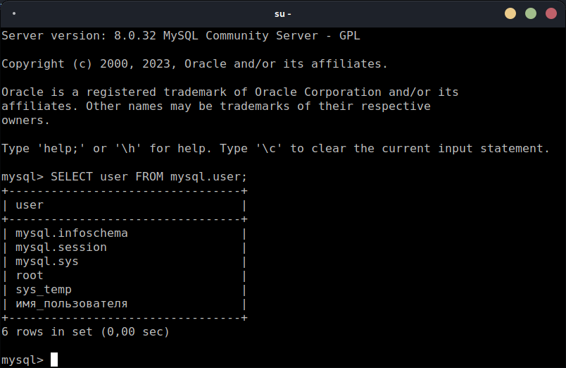
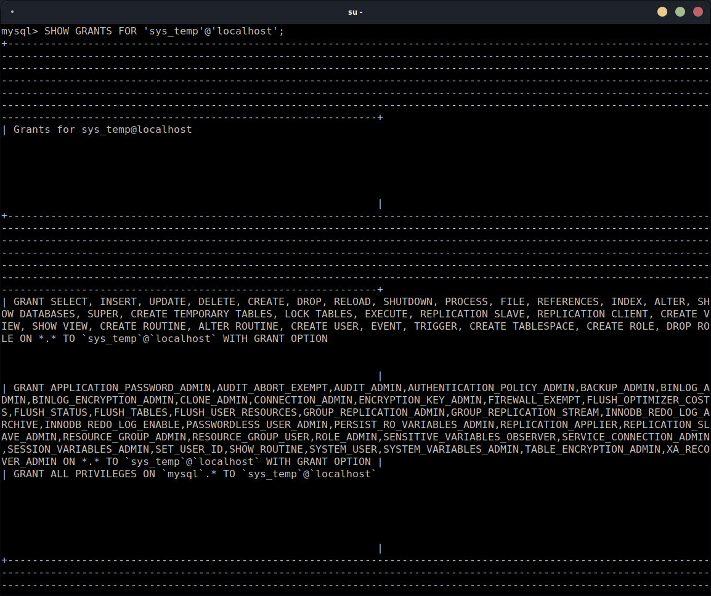
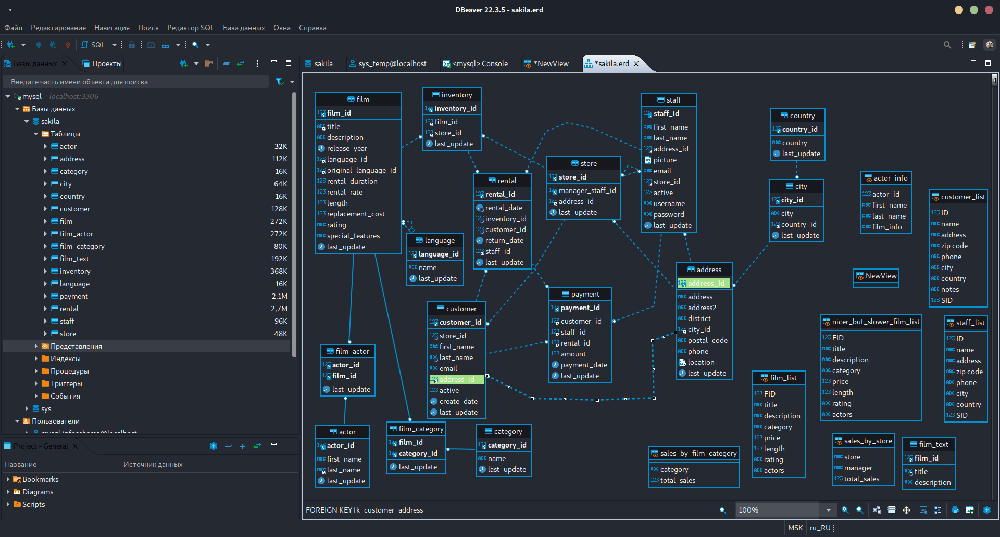
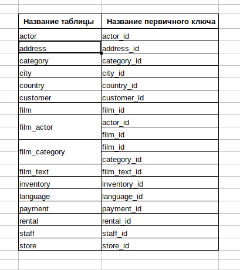

# Домашнее задание к занятию "`12.2. «Работа с данными (DDL/DML)»`" - `Живарев Игорь`


### Задание 1


1. `В качестве инстанса MySQL версии 8.0.24 использовался локальный сервер. Следует отметить, что с контейнерной версией проблем так же не наблюдалось.`

2. `Новый пользователь создан коммандой:`
```
CREATE USER 'sys_temp'@'localhost' IDENTIFIED BY 'password';
```

3. `Запрос на получение списка пользователей в БД:`
```
SELECT user FROM mysql.user;
```




4. `Добавление всех прав для пользователя sys_temp:`
```
GRANT ALL PRIVILEGES ON *.* TO 'sys_temp'@'localhost' WITH GRANT OPTION;
```

5. `Запрос на получение списка прав для пользователя sys_temp:`
```
SHOW GRANTS FOR 'sys_temp'@'localhost';
```


6. `В задании указан пользователь sys-test, хотя раннее задавался пользователь sys_temp. В виду этого комманда выглядет так:`
```
ALTER USER 'sys_temp'@'localhost' IDENTIFIED WITH mysql_native_password BY 'password';
```
`Если в этом и был смысл задания - убедительная просьба дать разъяснение!`

7. `Востановление скаченного дампа в БД sakila выполнялось посредством IDE Dbeaver. При еспользовании коммандной строки запрос выглядел бы следующим образом:`
```
mysql -usys_temp -ppassword sakila < ~/Загрузки/sakila-db/sakila-data.sql
```

8. `Сформированная ER-диаграмму получившейся базы данных:`




---

### Задание 2

`Таблица востановленной базы с первичными ключами:`



`У двух таблиц (film_actor, film_actor) по два первичных ключа.`
`Таблица film_actor не имеет связей с другими таблицами.`

